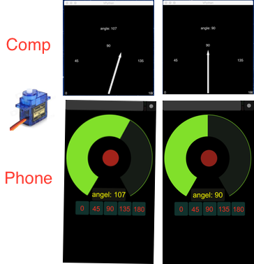

# ServoControl
## Remote control using Python, Arduino, OSC and TouchOSC App with Smartphone (iPhone iOS or Android)


This program is based on the code and instructions from **SILVINO J. A. PRESA**: <http://www.silvinopresa.com/how-to/python/control-a-servo-with-arduino-and-python-vpython/> **<-THANK YOU!** very, very much, it helped a lot.

I am not an experience Python programmer, so I wrote a mickey-mouse code to control a servo with my iPhone.
There are for sure much clever way's to do this, so all feedback and improvements are very welcome.

 
For instance I use an UDP server to get the controller path from the touchOSC app and then I start a OSC server to control it. There must be a smarter way to do this.

**so here we go:**  

index:

| code  | used by |device|
| ------------- | ------------- |------------- |
| OSC_servo.py  | python IDE  |computer  |
| Servo.touchOSC  | touchOSC editor  |computer => phone touchOSC |
| Servo_Control.ino  | Arduino IDE  |computer => Arduino |

### Prerequisites:
## Software
on Mac or PC:  

* **Python editor:** I prefer PyCharm (mac/win): <https://www.jetbrains.com/pycharm/> 
* **Arduino IDE:** <https://www.arduino.cc/en/main/software>
* **touchOSC editor:** <https://hexler.net/software/touchosc> scroll too the end of the page: Downloads -> choose your OS.  
 
on Smartphone (iPhone or Android)  

* * **touchOSC app:** iOS: <https://hexler.net/software/touchosc> android: <https://hexler.net/software/touchosc-android>  price: $5

## Python Modules
I use  **Python 2.7.13**, on the **Mac** be sure you use the FrameWork version, otherwise the Vpython graphic display will not work: ```/opt/local/Library/Frameworks/Python.framework/Versions/2.7/bin/python2.7```

* **OSC:** Unix terminal: ```$ pip install pyosc``` or download: <https://github.com/ptone/pyosc>  
if you have trouble installing it, you can also put the ```OSC.py``` that is in the downloaded package, in the same folder you have ```OSC_Servo.py```

* **Vpython:**```$ pip install vpython```
* **serial:**```$ pip install pyserial```
* **numpy:**```$ pip install numpy```
* **socket:** I guess it is a standard Python package, but had a lot of trouble getting it working. Be sure you have no other socket.py some where in your directories.

## Arduino Libraries
**Servo:** <https://www.arduino.cc/en/reference/servo>

## Hardware
* **Arduino Board (Uno):** <https://www.arduino.cc/> and many other companies. Mine comes from China (Oops!)
* **Servo Motor:** I use TowerPro SG90, do a google search and you get a lot of hits.

## Circuit


## TouchOSC editor Computer

Double click the ```Servo.touchosc``` file, and the ```TouchOSC editor``` should open or open it from inside the editor.  
 Click the ```Sync``` button, in the upper right of the window.

## ToucOSC app on Phone
* click the white spot on upper right of the window, choose the upper item  
* ```OSC:``` and fill in the ```TCP address```, variable in the ```OSC_Control.py``` =>```serverAdr = "192.168.0.104"``` <= **ofcource you have to change this to your computer ```tcp address```!!!** 
* ```Port(outgoing)``` is set to ```8000```, variable in the ```OSC_Control.py``` =>```serverPort = 8000```
* ```Port(incomming)``` is set to ```9000```, variable in the ```OSC_Control.py``` =>```clientPort = 9000```
* ```Local IP address``` is variable in  ```OSC_Control.py``` =>```clientAdr = "192.168.0.102"```<= **ofcource you have to change this too your Phone  ```IP address```!!!** 
Bellow the settings on my iPhone:

  

Return to ```< TouchOSC``` upper left corner and choose the item under ```LAYOUT```, choose ```Add```  
Now you can choose the ```Servo``` layout.

## Arduino IDE
Open the ```Servo_Control.ino```file and send it to the Arduino. Be sure that the right type Arduino and serial Port is choosen => ```Menubar -> Tools -> Board: / Port:```  
Now you see also the name of the serialPort that you need to set in ```OSC_Control.py``` => variable: ```serialPort = "/dev/tty.wchusbserialfa130"```. On the Mac it is something like this, on WIN is somethins like ```COMn```  
  
First compile your sketch, do not open the serial monitor, and then run ```OSC_Control.py``` Other wise you get the message:  
```avrdude: ser_open(): can't open device "/dev/cu.wchusbserialfa130": Resource busy``` 

## OSC_Control.py
change the variables acording to your eviroment:  

```
serialPort = '/dev/tty.wchusbserialfa130'
serverAdr = "192.168.0.104"
serverPort = 8000
clientAdr = "192.168.0.102"
clientPort = 9000
```

WARNING: if you not use a fix IP address, but get if from a DHCP server, the IP address can change, special on the Phone, that is reconecting to your network if you return from an other place.
error message is e.g:  
OSCServer: NoCallbackError on request from 192.168.0.103:64550: No callback registered to handle OSC-address '/1/push2'
you see: if have my Phone IP defined as ```192.168.0.102``` but it is now: ```192.168.0.103```  
  
it take a few moments to start, also it a bit slow to receive the fist messages.  
output looks like this:

```
Arduino Serial Port: /dev/tty.wchusbserialfa130 
    Computer server: 192.168.0.104  port: 8000
       Phone client: 192.168.0.103  port: 9000

 waiting for Phone...
/1/rotary1 => 0.54  97
/1/push3 => 0.50  90
/1/rotary1 => 0.48  86
/1/rotary1 => 0.29  52
/1/push5 => 1.00  180

controller => rotaryValue angleValue

```

### Famous last words: "IT SHOULD WORK!"###
###Happy trouble shooting and debugging!!!###
#-=b=-#
 bert@temminck.net, April 2017, Anápolis-GO, BRASIL
